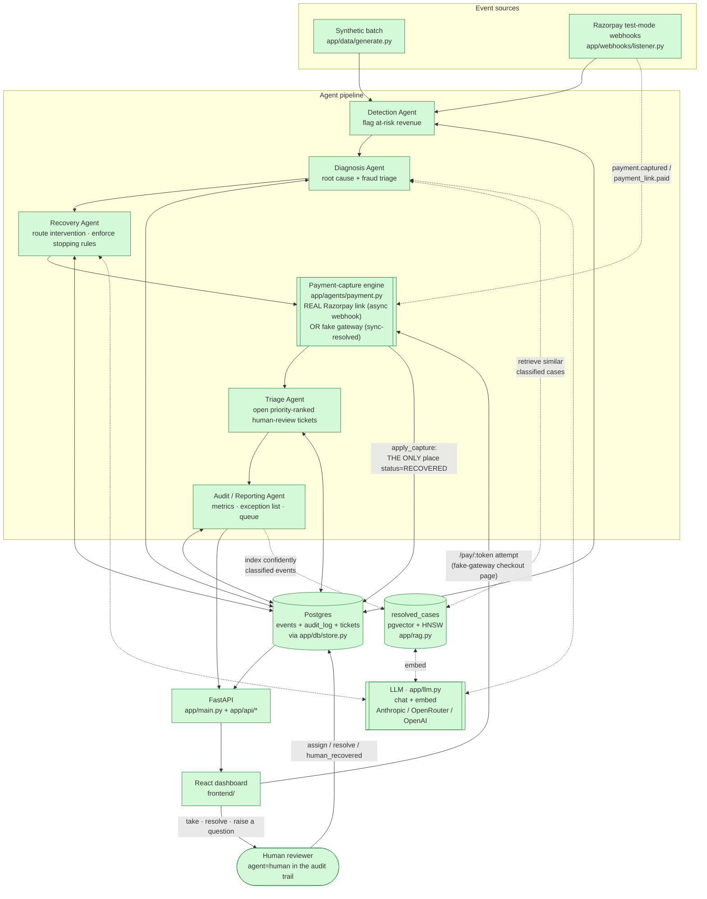
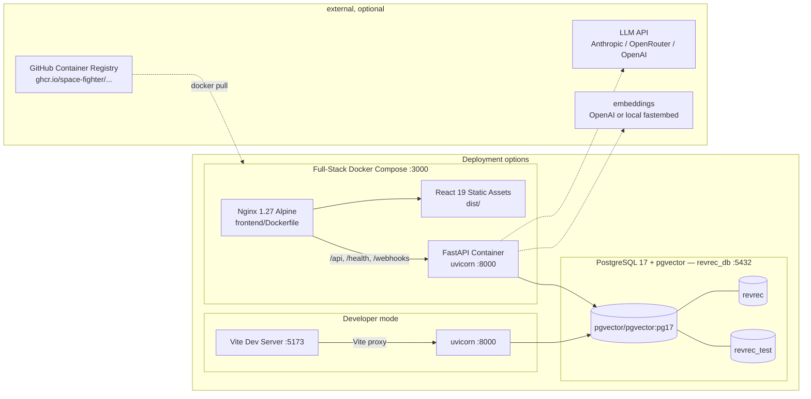
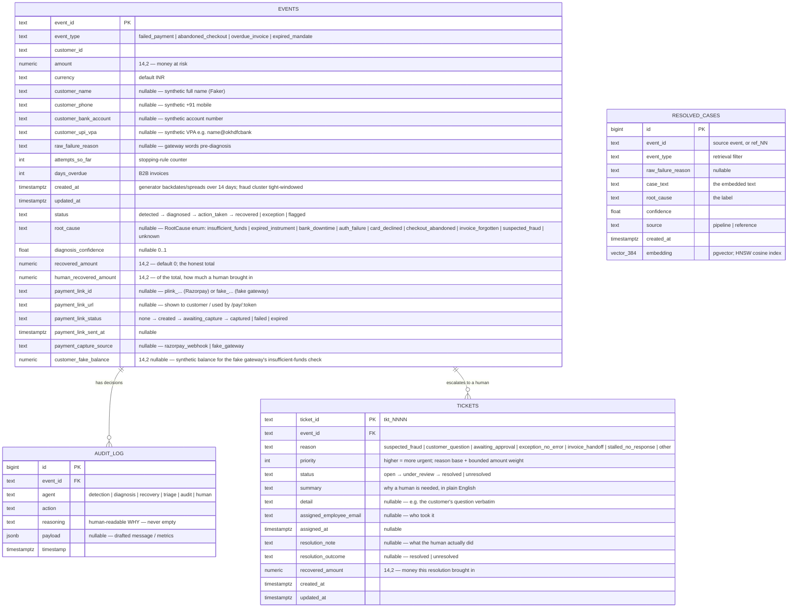
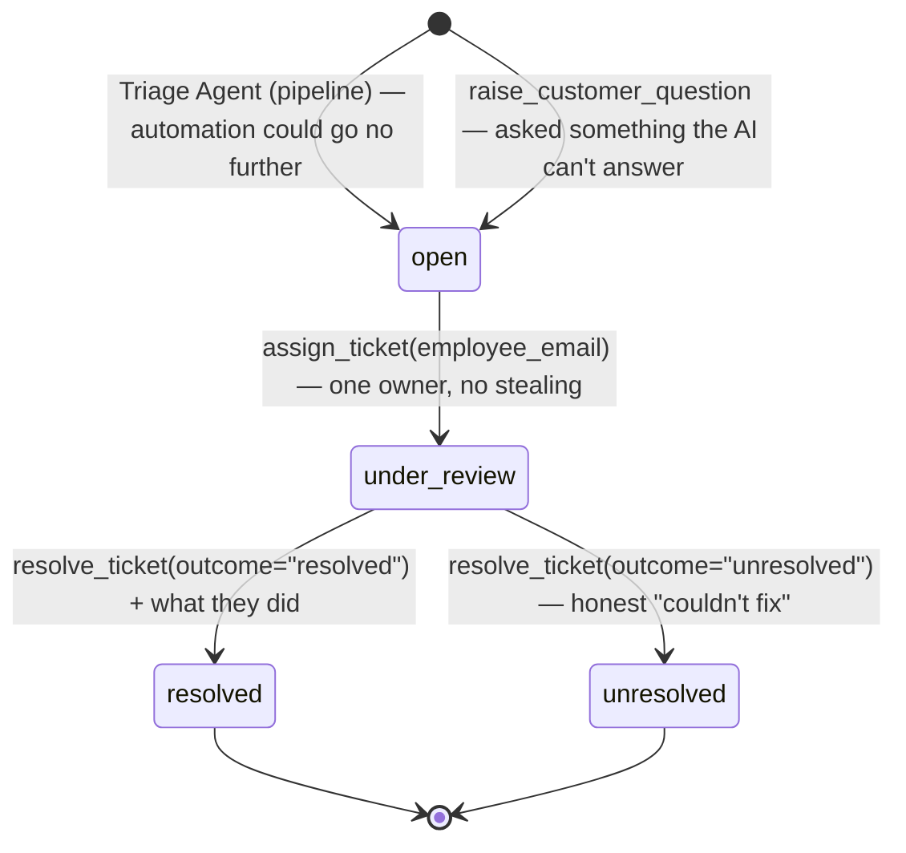
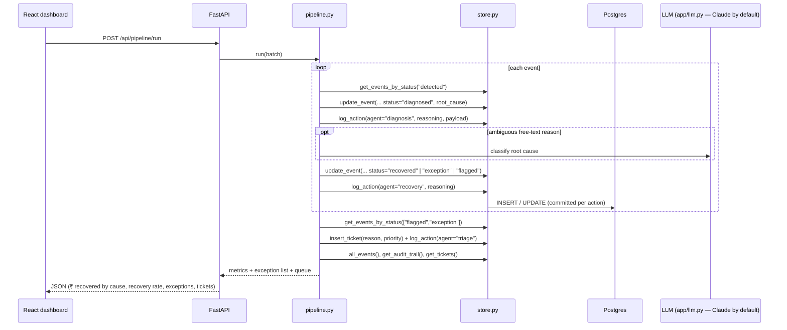
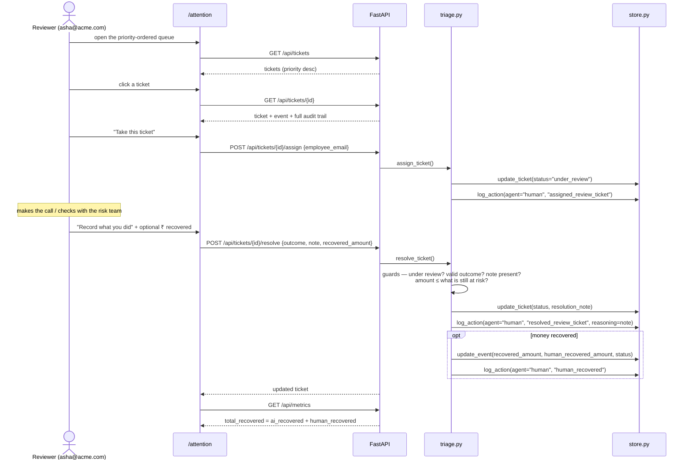
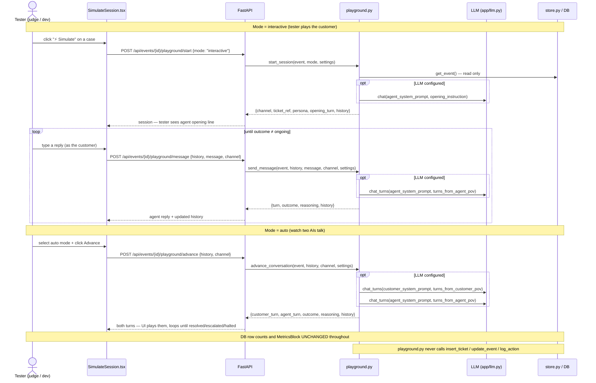

# Architecture — AI Revenue Recovery

Diagrams and design rationale. Companion to
[documentation.md](documentation.md) (exhaustive file/function reference) and
[CLAUDE.md](CLAUDE.md) (project brief).

> **Keep this current.** CLAUDE.md Section 13 requires this file to be updated in
> the same change that alters the architecture, data model, agent flow, or
> runtime topology.

Last updated: 2026-09-05 — **Simulate tab Controls & Actions rework** (plan.md §9,
Simulate/Playground UI): see §6.2's new sequence diagram — tester-picked
checkout mistakes via `forced_reason` on `playground.click_payment_link`
(AGENTS_CONTRACT.md §12/§13 S9), the salary-day reschedule for
`insufficient_funds`, and the PTP → simulated-human-review → recovered
`ticketStatus` hand-off in `SimulateSession.tsx`. `payment.py`'s frozen
`CaptureResult` contract and the real `/pay/:token` DB-writing flow are
untouched.
<!-- previous update: Systemized Unified Audit Log & Customer Action Trail -->

Previously (2026-09-05) — **Systemized Unified Audit Log & Customer Action Trail** (plan.md §15):
Unified the AI pipeline decision trail and simulation event logs into one standardized, systemized, color-coded audit log component (`frontend/src/components/AuditTimeline.tsx`). Customer actions (link clicks, OTP entries, customer replies, calls answered, silence) elevated to first-class audit events; strict chronological sorting merges store records and live simulation events via a monotonic `sortKey`; 7 semantic color-coded categories with interactive filter pills; specialized inline cards for Payment Links, Mandate Renewals, and verified Payment Captures. Deployed across `TicketDrawer.tsx`, `DetailDrawer.tsx`, and `SimulateSession.tsx` Column 2.

Prior: 2026-09-04 — **Simulate / Playground + Sarvam TTS fix + synthetic
contact data**: `app/agents/playground.py` (stateless sandboxed rehearsal agent,
two LLM personas), 3 new API routes (`POST /events/{id}/playground/start|message|advance`),
frontend `SimulateSession.tsx` + `Playground.tsx`, `chat_turns()` in `llm.py`;
synthetic contact fields (`customer_name/phone/bank_account/upi_vpa`) on `Event`;
fixed Sarvam TTS root cause (`VITE_DATA_SOURCE` was missing from `frontend/.env`).
New §6.2 Simulate sequence; §4 ERD + §7 component table + §8 design log updated.
Prior: 2026-09-04 — **Urgent human attention**: a `tickets` table +
Triage agent (`app/agents/triage.py`) between Recovery and Audit, a
priority-ordered review queue with a take → record-what-you-did → resolved /
unresolved lifecycle, `agent="human"` audit rows, and AI-vs-human recovered-money
attribution (`Event.human_recovered_amount`). New §5.1 (ticket lifecycle) and
§6.1 (a human working the queue); §2 / §4 / §5 / §7 / §8 updated.
Prior: 2026-09-04 — Direction 6 spoken playback: Sarvam AI (`bulbul`) neural
TTS for the Hinglish Voice Recovery Agent (`app/agents/voice_tts.py`, `GET
/api/events/{id}/voice/audio`); `VoiceCallDrawer` plays per-turn Sarvam WAV clips
and degrades to the browser `SpeechSynthesis` voice when `SARVAM_API_KEY` is unset
or the provider errors.
Prior: 2026-09-04 — Extended Capabilities: Direction 5 (Mandate Retry Sequencer: `app/agents/sequencer.py`),
Direction 6 (Hinglish Voice Recovery Agent: `app/agents/voice.py` + `VoiceCallDrawer`), Direction 7 (Promise-to-Pay Tracker: `app/agents/ptp.py` + `PTPModal`).
Prior: 2026-09-04 — Multi-stage Docker containerization & GitHub Actions CD
(`.github/workflows/cd.yml` → GHCR image registry; `backend/Dockerfile` + `frontend/Dockerfile` + `nginx.conf` + full-stack `docker-compose.yml`).
Prior: 2026-09-04 — Razorpay test-mode webhook listener
(`app/webhooks/listener.py`, `POST /webhooks/razorpay`) as a second event
source into Detection; pipeline diagram node `WH` → done. Prior: 2026-09-04 —
RAG knowledge base (`app/rag.py`: pgvector
`resolved_cases` + HNSW, wired into Diagnosis; embeddings via `app/llm.embed`);
Postgres moved to the `pgvector/pgvector` Docker container (Docker + WSL2 work
here — the earlier note was wrong). Prior: 2026-09-04 — provider-agnostic LLM
client (`app/llm.py`: Anthropic / OpenRouter / OpenAI, auto-detected). Prior:
2026-09-04 — Phase B + C of the agent-team build (plan.md §9 steps 3–8): all four agents built + merged,
`app/pipeline.py` chains them, `app/api/*` routers mounted in `main.py`, React
dashboard built, pipeline nodes recoloured `done`. Prior: 2026-09-03 — Phase A
(RootCause vocabulary, cross-agent + API contract frozen). Prior: 2026-08-28 —
step 2 (synthetic data generator); datastore switched from Docker to a local
PostgreSQL process.

---

## 1. One-paragraph summary

Synthetic (and later, real Razorpay test-mode webhook) events flow through
sequential agents — **Detection → Diagnosis → Recovery → Triage → Audit** — that
all read and write one shared Postgres store via `app/db/store.py`. Every
money-related decision is written to the `audit_log` table *as it happens*; that
table **is** the audit trail. Recovery is root-cause-differentiated and bounded
by explicit stopping rules; a fraud-like cluster is deliberately re-classified as
`flagged` and left alone. Where the automation stops, **Triage** opens a
priority-ordered human-review ticket, and a person's own actions — taking a
ticket, recording what they did, recovering money themselves — are written to the
same audit trail as `agent="human"`. A FastAPI backend exposes the store and the
pipeline over REST; a React dashboard renders the at-risk queue, per-case
decision trails, recovery metrics, an honest exception list, and the urgent
human-attention queue.

---

## 2. Agent pipeline



Both event sources feed the same store: the synthetic generator seeds a batch;
`app/webhooks/listener.py` ingests **signed Razorpay test-mode** webhook
deliveries (`payment.failed`, `payment_link.expired`, `invoice.expired`,
`subscription.halted`) as `detected` events. The pipeline is source-agnostic —
it only ever reads `status` from the store.

Dashed = optional/degrading edges: the LLM and the RAG knowledge base are used
when configured and are no-ops otherwise (Diagnosis falls back to its rules
classifier). `app/rag.py` retrieves the nearest already-classified cases from
`resolved_cases` (pgvector HNSW) as few-shot examples **before** the Diagnosis
LLM call; `pipeline.run` grows that knowledge base after each run (curated:
dedup + per-bucket cap).

**Triage** runs once every event is terminal. It opens exactly one review ticket
per case the automation could not carry further, scores it so the queue is
priority-ordered (suspected fraud ≫ a retry that merely ran out of attempts), and
never reopens a ticket a person has closed. The human's loop back into the store
is a real edge, not a diagram flourish: taking a ticket, closing it with a note,
and recording money they recovered each write an `agent="human"` audit row, and
human-recovered money is tracked separately from what the agents collected.

**Recovery no longer terminates directly in `recovered`/`exception` — it fans
into the payment-capture engine** (`app/agents/payment.py`, 2026-09-05).
`recovery.py._resolve_outcome` sends a payment link and stamps it onto the
event; a **real** Razorpay link genuinely waits for the webhook listener to
call `payment.apply_capture` asynchronously (the event stays `action_taken`
until then — honest, not a bug, if a demo run never gets a webhook); a
**fake** link (no keys configured — the default demo path) has no live human
to click it in a batch run, so `_resolve_outcome` resolves it synchronously,
inline. The Playground's `/pay/:token` page is the same engine's UI-fronted
surface for a human actually clicking a fake link. `apply_capture` is the
single place `Event.status` becomes `RECOVERED` from a capture, replacing the
previous `recovery.py`-internal `_stable_hash` coin flip that set `RECOVERED`
with no capture evidence behind it at all.

Green = built. `app/pipeline.py` chains DET→DIA→REC→PAY→TRI→AUD; `app/api/*`
exposes the store + pipeline + review queue + `/pay/:token` over REST; the
React dashboard renders it.

---

## 3. Runtime topology



---

## 4. Data model



`RESOLVED_CASES` is the RAG knowledge base (`app/rag.py`). It has **no FK** to
`EVENTS` — rows outlive individual batches and reference cases have no event.
Created only when the target Postgres has the `vector` extension.

---

## 5. Event lifecycle

```mermaid
stateDiagram-v2
    [*] --> detected : generator / Detection Agent
    detected --> diagnosed : Diagnosis Agent sets root_cause
    detected --> exception : obvious non-recoverable
    diagnosed --> flagged : Triage — fraud-like cluster (HALT)
    diagnosed --> action_taken : Recovery Agent runs an intervention
    action_taken --> action_taken : payment_link_sent (awaiting_capture) — a real Razorpay link waits for an async webhook
    action_taken --> recovered : payment.apply_capture() confirms a capture (fake gateway resolves sync; a real webhook resolves async)
    action_taken --> exception : capture failed / stopping rule hit / gave up (with reason)
    action_taken --> action_taken : retry within limits (attempts_so_far++)
    exception --> recovered : human resolves a ticket, money in (agent=human)
    flagged --> recovered : human confirms genuine + collects (agent=human)
    recovered --> [*]
    exception --> [*]
    flagged --> [*]
```



`recovered` / `exception` / `flagged` are terminal **for the automation**.
`exception` = honest "couldn't recover, here's why"; `flagged` = deliberately
stopped (suspected abuse), never retried by an agent. The only way out of a
terminal state is a **person** closing a review ticket having actually collected
the outstanding money — an audited, attributed override, never an automated one.

**`action_taken --> recovered` is gated on a real payment capture** (§5.2) —
never a coin flip or a conversation outcome. See "Key design decisions" (§8)
for why this replaced the earlier `_stable_hash`-only outcome.

### 5.2 Payment-link lifecycle (`app/agents/payment.py`)

```mermaid
stateDiagram-v2
    [*] --> none
    none --> created : create_payment_link() — Razorpay test-mode link, or a fake_... token when no keys are configured
    created --> awaiting_capture : link handed to the customer (payment_link_sent_at stamped)
    awaiting_capture --> captured : apply_capture(captured=True) — Event.status becomes RECOVERED here, and ONLY here
    awaiting_capture --> failed : apply_capture(captured=False) — wrong_otp | insufficient_funds | user_cancelled; Event.status left to the caller
    awaiting_capture --> expired : link/webhook never arrives
    captured --> [*]
    failed --> [*]
    expired --> [*]
```



Orthogonal to `PTPStatus` — an event can be `ptp_status=promised` (a future
promised date) and `payment_link_status=awaiting_capture` (a link already
sent) at the same time; a same-session webhook wait must never corrupt PTP's
real grace-period semantics. The **fake-gateway path resolves synchronously**
(no live human to click a link in a batch run, explicitly modeled as "the
gateway resolves for the synthetic customer"); the **real Razorpay path stays
`awaiting_capture`** until an async `payment.captured`/`payment_link.paid`
webhook confirms it — honestly non-terminal if that webhook never arrives in
an offline demo run.

### 5.1 Human-review ticket lifecycle



Closed is closed: a later pipeline run never reopens or duplicates a ticket a
person has already dealt with. Every transition writes an `agent="human"` audit
row, and the reviewer's own note becomes that row's `reasoning` verbatim — so
the case trail reads as one story from first detection to the person who
finished it.

---

## 6. Request / data flow (target, once API + agents exist)



### 6.1 A human working the queue



### 6.2 A Simulate / Playground session (sandboxed rehearsal)



The Playground is **explicitly excluded from `MetricsBlock`**: it calls no store
write functions. The `history` list lives in the browser and is resent with every
request — the backend is completely stateless for Simulate sessions. A judge
playing *"yes I'll pay"* cannot move real recovery metrics.

**2026-09-05 redesign** (diagram above still holds structurally; details
updated): "interactive"/"auto" renamed `"custom"`/`"ai"` (legacy names still
accepted); a sibling `sim_state` dict (game clock, escalation stage,
`outstanding_asks`, response probability) is now resent alongside `history` on
every call, still entirely client-held — the backend remains stateless. Either
role can now be taken over by a human via `sim_state.controlled_by`. A
`POST /playground/pay` step calls `click_payment_link`, which calls the same
**pure** `payment.resolve_fake_capture` the real pipeline uses (weighted
wrong_otp/insufficient_funds/user_cancelled/success) but **never**
`payment.apply_capture` — the one hard boundary that keeps this diagram's
"never writes to the store" guarantee true even though the module now shares
code with the money-moving payment engine.

**2026-09-05 (Controls & Actions rework) — tester-picked checkout + PTP hand-off:**

```mermaid
sequenceDiagram
    actor T as Tester
    participant UI as SimulateSession.tsx
    participant API as FastAPI
    participant PG as playground.py

    Note over T,UI: Any turn's text contains a rzp.io/razorpay.me link
    T->>UI: click the link (renderMessageText)
    UI->>UI: setPhoneView('checkout') — swaps WhatsApp body for embedded checkout, no API call
    alt Tester backs out
        T->>UI: click "‹ Back to WhatsApp"
        UI->>UI: setPhoneView('chat') — no API call, no state change
    else Tester picks a mistake to simulate
        T->>UI: pick one of success / wrong_otp / wrong_password / user_cancelled / insufficient_funds
        UI->>API: POST /playground/pay {history, channel, sim_state, forced_reason}
        API->>PG: click_payment_link(event, history, channel, sim_state, forced_reason)
        alt forced_reason == "insufficient_funds"
            PG->>PG: sim_state.salary_reminder_day = sim_day + 5; _advance_day(st)
            PG-->>API: {outcome: "ongoing", turn: "...reminder on Day N", ...}
        else other forced_reason
            PG-->>API: {captured, reason, turn: cause + how-to-fix, outcome}
        end
        API-->>UI: result
        UI->>UI: setPhoneView('chat'); applyOutcome(...)
    end

    Note over T,UI: Promise-to-Pay hand-off
    T->>UI: click "Record Promise to Pay (PTP)"
    UI->>API: POST /playground/message (canned PTP commitment line)
    API-->>UI: outcome = ptp_promised
    UI->>UI: applyOutcome sets ticketStatus='ptp_human_review'; AI-engine buttons disable;<br/>logs ticket_opened_ptp
    Note over T,UI: Later — customer completes payment via the checkout flow above
    UI->>UI: applyOutcome sees outcome='resolved' while ticketStatus='ptp_human_review'<br/>→ ticketStatus='recovered'; logs ticket_closed_recovered
```

`forced_reason` is playground-only state — it never reaches `payment.py`'s
frozen `CaptureResult` vocabulary (`wrong_password` has no equivalent in the
real `/pay/:token` flow). `ticketStatus` is UI-only React state, not a real
`tickets` row — the module's "never writes to the store" guarantee (above)
still holds; this is a rehearsal of what a real triage hand-off *would* look
like, not one.

---

## 7. Component responsibilities

| Component | File(s) | Responsibility | Must guarantee |
|---|---|---|---|
| Event store | `app/db/store.py` | single interface to Postgres; table + schema models; CRUD + audit | no raw SQL elsewhere; `log_action` is the only audit write; FK-checked; validated input |
| Synthetic generator | `app/data/generate.py` | deterministic 50–100 event batch + fraud cluster; real Razorpay failure codes | reproducible per seed; every record schema-valid; fraud cluster has a detectable shared signature |
| Detection Agent | `app/agents/detection.py` ✅ | flag genuinely at-risk events; route obvious non-recoverables to `exception` | one audit row per decision; idempotent |
| Diagnosis Agent | `app/agents/diagnosis.py` ✅ | rules-first root-cause classification; **RAG-then-LLM** fallback for free-text (retrieve similar past cases → few-shot the LLM); **fraud-cluster triage → `flagged`** | confidence recorded; triage reasoning explicit; RAG + LLM isolated + offline-safe |
| RAG knowledge base | `app/rag.py` + `store.resolved_cases` ✅ | embed a case, retrieve nearest classified cases (pgvector HNSW); grow the KB after each run (curated, bounded) | no-op without pgvector / embeddings; the only vector search is `store.nearest_resolved_cases` |
| LLM client | `app/llm.py` ✅ | `chat()` + `embed()`, provider auto-detected | never raises; deterministic fallback when unconfigured |
| Recovery Agent | `app/agents/recovery.py` ✅ | root-cause-specific intervention; draft outreach; **enforce stopping rules** (max attempts, max escalation, cooldown, amount gate) | bounded; never reads `flagged`; human-approval flag above ₹5,000 (logged, not executed); deterministic outcome |
| Mandate Retry Sequencer | `app/agents/sequencer.py` ✅ | intelligent multi-step mandate & subscription retry schedule (Direction 5) | rail-aware (UPI AutoPay / e-NACH / Card Token), calendar & salary cycle optimized, NPCI 3-attempt limit |
| Hinglish Voice Recovery | `app/agents/voice.py` ✅ | conversational multi-turn phone call scripts & WhatsApp copy in natural Hinglish (Direction 6) | natural code-switching, empathetic tone, offline deterministic fallback scripts |
| Hinglish Voice TTS | `app/agents/voice_tts.py` ✅ | synthesize each dialogue turn via Sarvam AI `bulbul` (agent vs customer speaker), return base64 WAV clips | optional (needs `SARVAM_API_KEY`); never raises — degrades to `available:false` so the dashboard uses the browser voice |
| Simulate / Playground | `app/agents/playground.py` ✅ | stateless sandboxed rehearsal of a recovery outreach: two independently-prompted LLM personas (Resolver + Customer/Business) converse turn-by-turn via `chat_turns`; `interactive` mode (tester plays the customer) or `auto` mode (two AIs talk). Never writes to the store — the core safety property | read-only against the store; deterministic offline fallback so it runs without an LLM key; `pick_channel`, `build_persona`, `start_session`, `send_message`, `advance_conversation` are the public API; Sarvam TTS optional per turn |
| Triage Agent | `app/agents/triage.py` ✅ | open one priority-scored review ticket per case the automation could not finish; carry the three human actions (take / resolve / raise a customer question) | idempotent — never duplicates or reopens a closed ticket; every human action writes an `agent="human"` audit row; resolution money bounded by what is still at risk |
| Promise-to-Pay (PTP) Tracker | `app/agents/ptp.py` ✅ | commitment state machine: pause escalation, track honor/breakage, metrics (Direction 7) | pauses automated contact during commitment window; records fulfillment & breakage to audit trail |
| Audit / Reporting | `app/agents/audit.py` ✅ | `compute_metrics` rolls `audit_log` + `events` into the MetricsBlock; `run` writes one `batch_metrics` row | computed over the full batch; exception list complete, never hidden; includes PTP metrics |
| Pipeline | `app/pipeline.py` ✅ | chains agents 3–6 into one run; returns the MetricsBlock | argparse CLI + printed summary |
| API | `app/main.py`, `app/api/*` ✅ | REST over store + pipeline (`/api/events`, `/api/events/{id}/audit`, `/api/metrics`, `/api/pipeline/run`) | CORS to frontend only |
| Dashboard | `frontend/src/pages/*` ✅ (fixtures; live via `VITE_DATA_SOURCE`) | at-risk queue, decision trail, charts, exception list, fraud-cluster alert | mirrors Razorpay's plain-English tone |
| Simulate / Playground UI | `frontend/src/components/SimulateSession.tsx` ✅ (rewritten 2026-09-05, Controls & Actions reworked 2026-09-05) | 4-column live-session layout: transcripts, unified audit/event trail, phone-style chat/call mockup (with an embedded fake-checkout sub-view for clicked payment links), and a trimmed Controls & Actions panel (AI Simulation Engine stack + PTP → simulated human-review hand-off) | liquid-glass throughout; `sim_state` round-tripped exactly as returned; never writes to the store; `ticketStatus` is local UI state, never a real `tickets` row |
| Unified Audit Log | `frontend/src/components/AuditTimeline.tsx` ✅ (revamped 2026-09-05) | single unified, systemized audit log engine across TicketDrawer, DetailDrawer, and SimulateSession: strict chronological sorting via monotonic sortKey; first-class Customer Actions (link clicks, OTP entries, customer replies, silence); 7 category color themes with interactive count-badged filter pills; specialized inline cards for Payment Links, Mandate Renewals, Payment Captures, and PTP commitments | unified presentation; strictly chronological; identical contract across DB-backed and rehearsal surfaces |
| Payment checkout page | `frontend/src/pages/PayCheckout.tsx` ✅ (new 2026-09-05) | standalone `/pay/:token` page (no `AppShell` chrome) — OTP-entry simulation, bounded retry, terminal state past `MAX_ATTEMPTS` | the real customer-facing surface for the fake gateway; a real DB write via the backend's `/api/pay/{token}/attempt` |
| Webhook listener | `app/webhooks/listener.py` ✅ | ingest Razorpay **test-mode** webhook deliveries as `detected` events | HMAC-SHA256 signature verified over the raw body; idempotent (dedup by event id); success/unknown events acknowledged but ignored; amounts paise→₹; no PII stored (emails/phones hashed) |

---

## 8. Key design decisions

| Decision | Choice | Why |
|---|---|---|
| Unified Audit Log & Customer Action Trail | single `AuditTimeline.tsx` engine shared by TicketDrawer, DetailDrawer, and SimulateSession Col 2; Customer Actions elevated to first-class audit events; strictly sorted by monotonic `sortKey` | operational transparency: human reviewers and operators must see what the customer actually did (clicked link, submitted OTP, promised to pay, remained silent) interspersed in exact chronological order with agent decisions; specialized cards display payment link URLs, mandate renewals, and verified capture receipts inline |
| Datastore | PostgreSQL 17 via the `pgvector/pgvector:pg17` **Docker container** (`docker compose up -d`) | real types (`NUMERIC`, `TIMESTAMPTZ`, `JSONB`, `vector`); FK always on; pgvector native for the RAG layer. Docker Desktop + WSL2 work here — an earlier note claiming otherwise was wrong. `scripts/pg.ps1` (embedded binary, no extensions) kept as a no-Docker fallback with RAG disabled |
| ORM / validation | SQLModel (SQLAlchemy 2 + Pydantic) | one model stack for tables *and* API request/response shapes |
| Validation split | thin table models + `*Create` / `*Update` / `*Read` schema models | `table=True` disables Pydantic validation; schema models restore it (`extra="forbid"`, bounds, `field_validator`s) and double as API contracts |
| Money type | `Decimal` / `NUMERIC(14,2)`, quantised to paise | no float rounding drift in financial figures |
| Audit trail | `audit_log` table, written via `log_action` only, `reasoning` NOT NULL | "the bar" demands explainable + auditable; make silent actions impossible |
| Backend deps | `uv` + `pyproject.toml` + committed `uv.lock` | fast, reproducible, no `requirements.txt` |
| App shape | FastAPI backend + React/Vite/Tailwind frontend monorepo | owner chose a real API + JS UI over the brief's single Streamlit app |
| Determinism | generator seeded (`random.Random(seed)` + `Faker.seed_instance`) | repeatable demo & tests; fraud cluster reproducible. `created_at` is spread relative to build-time "now" (wall-clock, not seed-fixed) so the batch always looks recent; ids/amounts/types stay seed-deterministic |
| Event time axis | optional `EventCreate.created_at`; generator backdates the batch over 14 days, fraud cluster inside one 40-min window | the Diagnosis fraud-cluster check's "tight time clustering" clause needs a real time axis; a single-pass insert would make every `created_at` identical |
| Failure codes | real Razorpay error codes from `razorpay.com/docs/errors` | judged by Razorpay engineers — data must mirror their real system |
| Fraud handling | re-classify to `flagged`, Recovery refuses to act | the brief's required "one failure handled gracefully" moment |
| Parallel build isolation | each backend builder ran its tests against a dedicated DB (`revrec_test_diag` / `_rec` / `_aud`); merge + CI use `revrec_test` | five agents built in parallel without the per-test `reset_db` stomping each other |
| Audit entry points | `compute_metrics(session) -> dict` (pure, returned by pipeline + API) split from `run() -> list[str]` (writes the `batch_metrics` row) | keeps the uniform agent `run` signature while letting callers get the metrics without a write |
| Dashboard glass | `GlassCard` = frosted `backdrop-blur`, not the full liquid-glass refraction lib | meaning never rides on the effect; the lib can be layered in later with no API change |
| LLM provider | one `app/llm.py` client, provider auto-detected (`anthropic → openrouter → openai`); OpenRouter default model is still Claude | use whichever key is available without losing the "built on Claude" framing; both agent call-sites stay tiny and offline-safe |
| RAG storage | pgvector `resolved_cases` table + **HNSW** index; all search behind `store.nearest_resolved_cases` | one datastore, everything auditable in Postgres; HNSW is a real ANN algorithm (not brute force); a dedicated store (Milvus/Vespa/OpenSearch) is a one-function swap when the curated KB outgrows a single instance |
| RAG knowledge base | curated + bounded — dedup near-identical inserts, cap each `(root_cause, event_type)` bucket | the same "bounded, with stopping rules" discipline as the recovery agent; keeps the KB *useful* (hard cases, not millions of routine dupes) and cheap |
| RAG embeddings | `app/llm.embed` — OpenAI `text-embedding-3-small` (`dimensions=384`) or local `fastembed` `all-MiniLM-L6-v2` (384-d) | one fixed dimension either way; OpenRouter has no embeddings endpoint so an OpenRouter-only setup uses the local model; RAG is a no-op with neither |
| Not used | LangGraph; FAISS/Milvus/Vespa; `langchain-postgres` PGVector | pipeline is already a clean linear state machine; a dedicated vector store is premature at demo scale; LangChain's PGVector would add opaque library-managed tables and break "`store.py` is the only Postgres interface". LangChain is used only for the `Embeddings` interface wrapper |
| **Payment capture is one engine, one gate** | `Event.status` becomes `RECOVERED` ONLY via `payment.apply_capture` (§5.2) — never the old `recovery._resolve_outcome` coin flip (`_stable_hash(event_id) % 100 < p`) directly setting status | a judge inspecting the audit trail must never see "recovered" with no money-movement evidence behind it; a single, reused-everywhere function is the only way to make that guarantee hold across both the batch pipeline and the interactive Playground |
| Hybrid payment gateway | real Razorpay test-mode Payment Link when `RAZORPAY_KEY_ID`/`SECRET` are configured (webhook-confirmed, async); otherwise a deterministic in-house fake gateway (sync-resolved) | Payment Links support test-mode creation + test-mode `payment_link.paid` webhooks (verified against Razorpay docs) — a genuine capability, not invented; the fake path keeps offline demos and tests fully deterministic with the same "never raises, always degrades" posture as `llm.py` |
| `PaymentLinkStatus` orthogonal to `PTPStatus` | two independent state machines on one `Event` | a promise-to-pay's future date and a same-session payment-link wait are different kinds of "not yet" — conflating them would corrupt `ptp.py`'s real grace-period logic |
| `resolve_fake_capture` is pure | no `session`/DB argument, reads only in-memory `Event` fields | lets the stateless, sandboxed Playground call the exact same capture logic as the real pipeline without ever risking a write to the real store |
| Simulate UI: chat bubbles + a separate structured log, not one or the other | `SimulateSession.tsx`'s two-column layout keeps the phone-style chat/call mockup *and* a timestamped Messaging/Call/Customer-Actions transcript panel, always both visible | a hand-drawn wireframe sketch the user provided this session called for exactly this split: a conversational view for "does this feel like a real interaction" and a structured, timestamped log for "what did the simulation engine actually decide" — collapsing them into one view (the pre-rewrite single-column tab-switcher) hid the audit-style detail a reviewer needs, especially for `click_payment_link` outcomes |
| Payment-link-click outcomes get their own log line, not a chat bubble | rendered in the Customer Actions panel, distinct from `history` | mirrors the real pipeline's own posture (a capture is a distinct auditable event, `payment_captured`/`payment_capture_failed`, not conversation text) — folding it into a chat bubble would visually imply the capture was "just something someone said" |
| `/pay/:token` is a page, not a drawer | `PayCheckout.tsx` renders full-screen outside `AppShell` | a real customer clicking an SMS/WhatsApp link has never seen the ops dashboard and shouldn't; a drawer implies dashboard context that doesn't exist for them |
| Root-cause vocabulary | `RootCause` `StrEnum` in `store.py` (9 members), one Recovery intervention each | keeps Diagnosis output and Recovery routing in lockstep; DB column stays `str \| None` (no migration), enum enforced at the schema layer (`EventUpdate`) |
| Cross-agent coupling | frozen `AGENTS_CONTRACT.md` (I/O table, `action` registry, stopping-rule constants, fraud signature, `payload` shapes) | agents are sequential at runtime but independent at build time — a contract lets the four modules be built in parallel by separate agents |
| Recovery outcome | deterministic per `hash(event_id)` vs a per-intervention success rate | stable, repeatable demo + tests; no RNG in the pipeline |
| Failure codes | corrected to real Razorpay test-mode strings (`insufficient_fund`, `authentication_failed`, `payment_timed_out`, `card_number_invalid`) verified 2026-09-03 | judged by Razorpay engineers; earlier codes (`insufficient_funds`, `incorrect_otp`) were near-misses |
| Human review as a **table**, not columns on `events` | new `tickets` table, FK to `events` | a ticket has its own lifecycle, owner and history independent of the event's; one event can be escalated more than once (e.g. a stalled retry, then a customer question). Columns on `events` would have flattened all of that into one mutable row |
| Ticket priority | integer score = reason base + `min(15, amount/5000)`, banded for display | ordering the queue is a *product* decision, so it lives in visible constants (`triage.PRIORITY_BASE`), not emergent sorting. Reason dominates; money only breaks ties, so a ₹45,000 stalled retry can never outrank a ₹400 fraud halt |
| "Tried 3×, no response" **is** ticketed, at the lowest band | `stalled_no_response`, base 25 | the automation behaved correctly and stopping rules did their job — but it is still lost revenue a person may choose to chase. Making it invisible would hide real money; making it urgent would bury the fraud and approval work. Lowest band is the honest middle |
| Human actions are `agent="human"` | new `Agent.HUMAN` enum member | the audit trail's whole value is that it names who decided. Laundering a person's decision through `agent="triage"` would have been a lie in the one table that must not lie |
| Reviewer note becomes the audit `reasoning` verbatim | `resolve_ticket(note=...)` → `log_action(reasoning=note)` | a human's own words are a better justification than anything generated for them; it also makes the note field impossible to leave empty (`reasoning` is NOT NULL) |
| Recovered money split AI vs human | `Event.human_recovered_amount` alongside the existing total | "measured money recovered" stays one honest total, but the dashboard can say what the agents actually earned. Deriving AI as `total − human` means no existing metric or write path changed |
| Human override of a terminal state | only via `resolve_ticket` with money that is bounded by what is still at risk | the lifecycle is forward-only for *agents*; a person may finish a case the automation gave up on, but only with a note, an identity, and an amount that cannot exceed the exposure |
| Reviewer identity | work email in `localStorage`, stamped on every action; no auth | the dashboard is an internal test-mode tool. The requirement is **attribution in the audit trail**, not access control — real deployment puts SSO in front. Pretending otherwise would be security theatre |
| Fixture-mode tickets are sticky | in-memory array in `dataSource.ts`, unlike the read-only event fixtures | the review flow is a *sequence* (take, then resolve). A demo where step one silently reverts would misrepresent how the feature behaves against the live API |
| Sarvam TTS root-cause fix (2026-09-04) | root cause was `frontend/.env` missing → `VITE_DATA_SOURCE` defaulted to `"fixtures"`, which never calls the backend and so never calls Sarvam | fixed by creating `frontend/.env` with `VITE_DATA_SOURCE=live`; no backend change required. Added a startup log line in `main.py` and a `reason` field to `voice_tts.synthesize_script`'s return dict for diagnosability. **Gotcha:** `get_settings()` is `@lru_cache`d — restart the backend process after any `.env` edit |
| `voice.py` prerecorded vs Simulate live (2026-09-04) | `app/agents/voice.py` is a **one-shot script** (one LLM call writes the entire dialogue up front, deterministic for a given case); `app/agents/playground.py` is **live, turn-by-turn** (two independently-prompted `chat_turns()` calls react to the real transcript so far) | the prerecorded transcript is correct for the dashboard "play back what the agent would say" UX — always the same, deterministic. Simulate is for a judge who wants to actually interact and see how the AI responds. Mixing the two models would break both use cases |
| Simulate sandboxing guarantee (2026-09-04) | `app/agents/playground.py` never calls `insert_ticket`, `update_event`, or `log_action`; the history list lives in the browser (resent each call); the backend is stateless per session | a judge playing "yes I'll pay" must never move the real `events`/`tickets` tables or the batch's `MetricsBlock`. Verified in `test_playground.py` with DB row-count before/after snapshots AND in `test_api.py` at the HTTP level |
| Synthetic customer contact data (2026-09-04) | `customer_name`, `customer_phone`, `customer_bank_account`, `customer_upi_vpa` added to `Event` / `EventCreate` / `EventRead`; generated via `_fake_contact()` in `generate.py` using Faker | Razorpay's test-mode docs have no customer/contact simulator (verified against the test-card/UPI docs); these fields exist so a case reads like a real record and the Playground has a persona to role-play against. Phone/bank-account shown **masked** in `DetailDrawer`. Never real PII |
| Tester-picked checkout outcome, not a random roll (2026-09-05) | `click_payment_link(..., forced_reason=...)` builds the `CaptureResult` locally instead of calling `payment.resolve_fake_capture` when the tester explicitly picks a mistake at the embedded checkout screen; `forced_reason=None` (every other caller) keeps the original random-roll path byte-for-byte | a rehearsal is for **demonstrating** each recovery path on demand (wrong OTP vs. wrong password vs. insufficient funds), not for hoping a random roll lands on the one you want to show a judge; keeping it opt-in preserves the existing weighted-random behavior for every other caller |
| `wrong_password` stays playground-only (2026-09-05) | added to `playground.py`'s local failure-copy map, never to `payment.py`'s `CaptureResult` reason vocabulary | `payment.py` is frozen and shared with the real, DB-writing `/pay/:token` flow (`AGENTS_CONTRACT.md` §11) — extending its contract for a sandbox-only distinction would ripple into `PayCheckout.tsx` and the real webhook-capture path for no real-flow benefit |
| `salary_reminder_day` is a relative-day approximation, not a calendar date (2026-09-05) | `sim_state.salary_reminder_day = sim_day + 5` on an `insufficient_funds` checkout failure; never escalates | the real pipeline's `recovery.SALARY_WINDOW_DAY` targets a calendar day-of-month; the Playground's `sim_day` is only a relative turn counter with no calendar backing, so a bounded fixed offset is the honest sandbox equivalent — documented as an approximation rather than silently reusing the real constant's semantics |
| PTP → simulated human review is UI state, not a ticket write (2026-09-05) | `SimulateSession.tsx`'s `ticketStatus` (`'none'\|'ptp_human_review'\|'recovered'`) drives a banner and disables the AI Simulation Engine buttons while "with a human"; clears to `'recovered'` when a later checkout succeeds | rehearses what a real triage hand-off *feels like* (case parked, only the payment-link path stays live, then closes out on payment) without touching the real `tickets` table — consistent with `playground.py` never calling `insert_ticket`/`update_event`/`log_action` |

---

## 9. Tech stack

| Layer | Tech |
|---|---|
| Language (backend) | Python 3.11 |
| Web framework | FastAPI + uvicorn |
| ORM / models | SQLModel · SQLAlchemy 2 · Pydantic 2 · pydantic-settings |
| DB driver | psycopg 3 (`postgresql+psycopg://`) |
| Database | PostgreSQL 17 + **pgvector** — `pgvector/pgvector:pg17` Docker container; `scripts/pg.ps1` embedded binary as a no-Docker fallback (RAG off) |
| Data / synthetic | pandas · Faker |
| LLM | Provider-agnostic via `app/llm.py` — Anthropic (SDK), OpenRouter or OpenAI (OpenAI-compatible REST over `httpx`); auto-detected; Diagnosis fallback + Recovery outreach; all optional |
| RAG | `app/rag.py` — pgvector HNSW `resolved_cases`; embeddings via OpenAI `text-embedding-3-small` or local `fastembed` (`all-MiniLM-L6-v2`, 384-d); `langchain-core` `Embeddings` wrapper; `numpy` |
| Payments | `razorpay` SDK — **test mode only**, later |
| Backend tooling | uv · pytest · httpx |
| Frontend | React 19 · Vite · TypeScript · Tailwind CSS v4 · Recharts |
| Frontend tooling | npm · oxlint |
| Containerization | Docker multi-stage (`python:3.11-slim` + `uv` backend, `nginx:alpine-slim` frontend, `pgvector:pg17` DB) |
| Orchestration | Docker Compose (full stack `:3000` / `:8000` / `:5432`) |
| CI / CD | GitHub Actions (`ci.yml` pytest & build/lint; `cd.yml` GHCR multi-stage image push with Buildx cache) |
